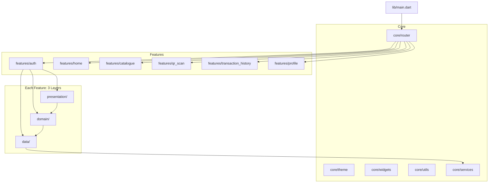
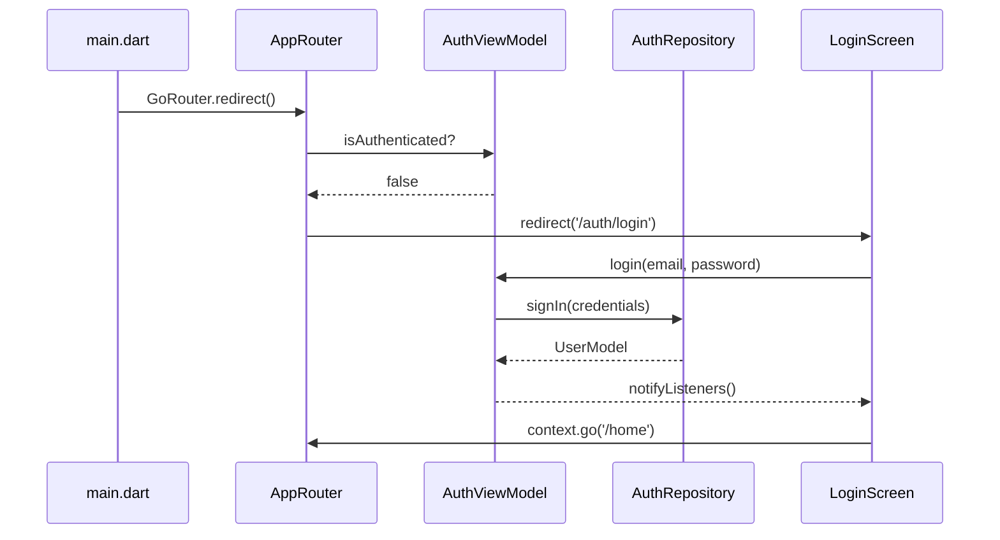
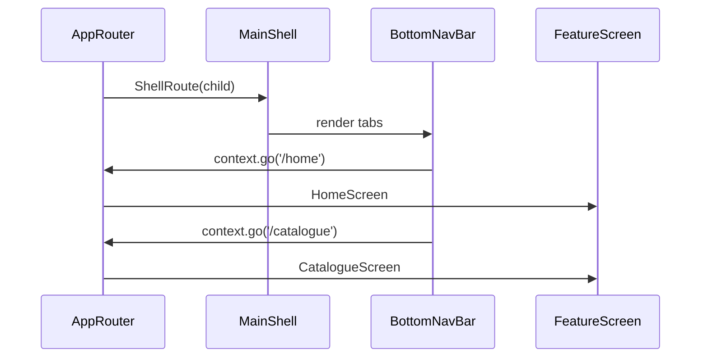

# Design Document: RewardHub App Structure

## Overview

This document defines the complete folder structure and architectural skeleton for the RewardHub Flutter loyalty rewards app. The structure follows Clean Code Architecture (MVVM + feature-based organization) as mandated by RULES.md, and is styled according to the "Digital Curator" design system defined in DESIGN.md.

The app has two top-level flows: **Authentication** (Login, Register) and **Main Shell** (Home, Catalogue, QR Scan, Transaction History, Profile), navigated via `go_router` with an auth-guard redirect.

---

## Architecture



---

## Sequence Diagrams

### Authentication Flow



### Main Shell Navigation Flow



---

## Components and Interfaces

### AppRouter

**Purpose**: Centralized `go_router` configuration with auth redirect guard.

**Interface**:
```dart
abstract final class AppRouter {
  static GoRouter build(AuthViewModel authViewModel);
}
```

**Responsibilities**:
- Define all named routes as constants
- Implement `redirect` callback checking `AuthViewModel.isAuthenticated`
- Wrap main tabs in a `ShellRoute` for persistent bottom nav
- Handle deep links

---

### AuthViewModel

**Purpose**: Manages authentication state and exposes login/register actions.

**Interface**:
```dart
class AuthViewModel extends ChangeNotifier {
  bool get isAuthenticated;
  bool get isLoading;
  String? get errorMessage;

  Future<void> login(String email, String password);
  Future<void> register(String email, String password, String name);
  Future<void> logout();
}
```

**Responsibilities**:
- Hold auth state (authenticated, loading, error)
- Delegate credential operations to `AuthRepository`
- Call `notifyListeners()` on state changes
- Log operations via `dart:developer`

---

### AuthRepository

**Purpose**: Abstracts the auth data source (remote API or local mock).

**Interface**:
```dart
abstract interface class AuthRepository {
  Future<UserModel> signIn(String email, String password);
  Future<UserModel> register(String email, String password, String name);
  Future<void> signOut();
  Future<UserModel?> getCurrentUser();
}
```

---

### MainShell

**Purpose**: Persistent scaffold with `BottomNavigationBar` wrapping all main tabs.

**Interface**:
```dart
class MainShell extends StatelessWidget {
  const MainShell({super.key, required this.navigationShell});
  final StatefulNavigationShell navigationShell;
}
```

**Responsibilities**:
- Render `BottomNavigationBar` with 5 tabs
- Delegate tab switches to `navigationShell.goBranch()`
- Apply glassmorphism style per DESIGN.md

---

### Feature ViewModels (per feature)

Each main feature follows the same ViewModel contract:

```dart
class HomeViewModel extends ChangeNotifier {
  bool get isLoading;
  String? get errorMessage;
  Future<void> loadData();
}
```

---

## Data Models

### UserModel

```dart
@JsonSerializable(fieldRename: FieldRename.snake)
class UserModel {
  final String id;
  final String name;
  final String email;
  final int pointsBalance;
  final String tierLevel;

  factory UserModel.fromJson(Map<String, dynamic> json);
  Map<String, dynamic> toJson();
}
```

**Validation Rules**:
- `id` is non-empty UUID string
- `email` matches valid email pattern
- `pointsBalance` is non-negative integer
- `tierLevel` is one of: `bronze`, `silver`, `gold`, `platinum`

---

### RewardItem (Catalogue)

```dart
@JsonSerializable(fieldRename: FieldRename.snake)
class RewardItem {
  final String id;
  final String title;
  final String description;
  final int pointsCost;
  final String imageUrl;
  final bool isAvailable;

  factory RewardItem.fromJson(Map<String, dynamic> json);
  Map<String, dynamic> toJson();
}
```

---

### Transaction

```dart
@JsonSerializable(fieldRename: FieldRename.snake)
class Transaction {
  final String id;
  final String type;       // 'earn' | 'redeem'
  final int points;
  final String description;
  final DateTime createdAt;

  factory Transaction.fromJson(Map<String, dynamic> json);
  Map<String, dynamic> toJson();
}
```

---

## Folder Structure

```
lib/
├── main.dart                          # App entry point, MaterialApp.router
│
├── core/
│   ├── theme/                         # ✅ Already exists
│   │   ├── app_colors.dart
│   │   ├── app_text_styles.dart
│   │   └── app_theme.dart
│   ├── widgets/                       # ✅ Already exists
│   │   └── app_button.dart
│   ├── router/
│   │   └── app_router.dart            # GoRouter config + auth redirect
│   └── utils/
│       └── logger.dart                # dart:developer wrapper
│
└── features/
    ├── auth/
    │   ├── data/
    │   │   ├── models/
    │   │   │   └── user_model.dart
    │   │   └── repositories/
    │   │       ├── auth_repository.dart          # abstract interface
    │   │       └── auth_repository_impl.dart     # concrete impl
    │   ├── domain/
    │   │   └── auth_view_model.dart
    │   └── presentation/
    │       ├── login_screen.dart
    │       └── register_screen.dart
    │
    ├── home/
    │   ├── data/
    │   │   └── repositories/
    │   │       └── home_repository.dart
    │   ├── domain/
    │   │   └── home_view_model.dart
    │   └── presentation/
    │       └── home_screen.dart
    │
    ├── catalogue/
    │   ├── data/
    │   │   ├── models/
    │   │   │   └── reward_item.dart
    │   │   └── repositories/
    │   │       └── catalogue_repository.dart
    │   ├── domain/
    │   │   └── catalogue_view_model.dart
    │   └── presentation/
    │       └── catalogue_screen.dart
    │
    ├── qr_scan/
    │   ├── data/
    │   │   └── repositories/
    │   │       └── qr_repository.dart
    │   ├── domain/
    │   │   └── qr_scan_view_model.dart
    │   └── presentation/
    │       └── qr_scan_screen.dart
    │
    ├── transaction_history/
    │   ├── data/
    │   │   ├── models/
    │   │   │   └── transaction.dart
    │   │   └── repositories/
    │   │       └── transaction_repository.dart
    │   ├── domain/
    │   │   └── transaction_history_view_model.dart
    │   └── presentation/
    │       └── transaction_history_screen.dart
    │
    └── profile/
        ├── data/
        │   └── repositories/
        │       └── profile_repository.dart
        ├── domain/
        │   └── profile_view_model.dart
        └── presentation/
            └── profile_screen.dart
```

---

## Algorithmic Pseudocode

### Router Auth Redirect Algorithm

```pascal
ALGORITHM authRedirect(state, authViewModel)
INPUT: state (GoRouterState), authViewModel (AuthViewModel)
OUTPUT: redirectPath (String?) — null means no redirect

BEGIN
  isAuthenticated ← authViewModel.isAuthenticated
  currentPath ← state.matchedLocation
  isAuthRoute ← currentPath STARTS_WITH '/auth'

  IF NOT isAuthenticated AND NOT isAuthRoute THEN
    RETURN '/auth/login'
  END IF

  IF isAuthenticated AND isAuthRoute THEN
    RETURN '/home'
  END IF

  RETURN null
END
```

**Preconditions**:
- `authViewModel` is initialized and reflects current session state
- `state.matchedLocation` is a valid non-empty path string

**Postconditions**:
- Unauthenticated users on protected routes are redirected to `/auth/login`
- Authenticated users on auth routes are redirected to `/home`
- All other cases return `null` (no redirect)

---

### ViewModel State Transition Algorithm

```pascal
ALGORITHM executeAsyncAction(action, viewModel)
INPUT: action (async operation), viewModel (ChangeNotifier with isLoading/errorMessage)
OUTPUT: void (side effects via notifyListeners)

BEGIN
  viewModel.isLoading ← true
  viewModel.errorMessage ← null
  viewModel.notifyListeners()

  TRY
    result ← AWAIT action()
    viewModel.handleSuccess(result)
  CATCH error
    viewModel.errorMessage ← error.message
    developer.log(error.message, name: 'rewardhub.vm', error: error)
  FINALLY
    viewModel.isLoading ← false
    viewModel.notifyListeners()
  END TRY
END
```

**Preconditions**:
- `action` is a valid async function returning a result
- `viewModel` has mutable `isLoading` and `errorMessage` fields

**Postconditions**:
- `isLoading` is always `false` after completion (success or error)
- On success: `errorMessage` is `null`, data is populated
- On error: `errorMessage` is non-null, data is unchanged
- `notifyListeners()` is called at start and end

**Loop Invariants**: N/A (no loops)

---

## Key Functions with Formal Specifications

### AppRouter.build()

```dart
static GoRouter build(AuthViewModel authViewModel)
```

**Preconditions**:
- `authViewModel` is non-null and initialized

**Postconditions**:
- Returns a configured `GoRouter` instance
- Router has `redirect` callback referencing `authViewModel`
- All 7 routes are registered: `/auth/login`, `/auth/register`, `/home`, `/catalogue`, `/qr-scan`, `/transactions`, `/profile`

---

### AuthViewModel.login()

```dart
Future<void> login(String email, String password)
```

**Preconditions**:
- `email` is non-empty and matches email format
- `password` is non-empty (min 6 chars)
- `isLoading` is `false` before call

**Postconditions**:
- On success: `isAuthenticated == true`, `errorMessage == null`
- On failure: `isAuthenticated == false`, `errorMessage` contains reason
- `isLoading == false` in all cases after completion

---

### MainShell tab switch

```dart
void _onTabTapped(int index, BuildContext context)
```

**Preconditions**:
- `index` is in range `[0, 4]`
- `navigationShell` is non-null

**Postconditions**:
- `navigationShell.goBranch(index)` is called
- Active tab indicator updates to `index`
- No navigation occurs if `index == currentIndex`

---

## Example Usage

```dart
// main.dart — wiring router with AuthViewModel
void main() {
  runApp(
    ChangeNotifierProvider(
      create: (_) => AuthViewModel(AuthRepositoryImpl()),
      child: const RewardHubApp(),
    ),
  );
}

class RewardHubApp extends StatelessWidget {
  const RewardHubApp({super.key});

  @override
  Widget build(BuildContext context) {
    final authViewModel = context.watch<AuthViewModel>();
    return MaterialApp.router(
      title: 'RewardHub',
      theme: AppTheme.light,
      routerConfig: AppRouter.build(authViewModel),
    );
  }
}
```

```dart
// Feature screen skeleton — HomeScreen
class HomeScreen extends StatelessWidget {
  const HomeScreen({super.key});

  @override
  Widget build(BuildContext context) {
    return ChangeNotifierProvider(
      create: (_) => HomeViewModel(HomeRepository())..loadData(),
      child: const _HomeView(),
    );
  }
}

class _HomeView extends StatelessWidget {
  const _HomeView();

  @override
  Widget build(BuildContext context) {
    final vm = context.watch<HomeViewModel>();
    if (vm.isLoading) return const Center(child: CircularProgressIndicator());
    return Scaffold(
      backgroundColor: AppColors.surface,
      body: SafeArea(child: Text('Home', style: AppTextStyles.headlineMd)),
    );
  }
}
```

---

## Correctness Properties

- For all routes `r` where `r` is not prefixed with `/auth`: if `AuthViewModel.isAuthenticated == false`, then `AppRouter.redirect` returns `/auth/login`
- For all `AuthViewModel` instances: after `login()` completes (success or failure), `isLoading == false`
- For all `ViewModel` instances: `errorMessage == null` if and only if the last async operation succeeded
- For all feature screens: the `ViewModel` is provided via `ChangeNotifierProvider` scoped to the screen subtree, never globally
- For all data models: `fromJson(model.toJson()) == model` (round-trip serialization identity)

---

## Error Handling

### Auth Errors

**Condition**: Invalid credentials or network failure during login/register
**Response**: `AuthViewModel.errorMessage` is set; screen displays inline error text using `AppColors.error`
**Recovery**: User can retry; `errorMessage` is cleared on next attempt start

### Navigation Errors

**Condition**: Unknown route path
**Response**: `GoRouter.errorBuilder` renders a minimal "Not Found" screen
**Recovery**: User taps back or home button

### Data Load Errors

**Condition**: Repository throws exception during `loadData()`
**Response**: ViewModel sets `errorMessage`; screen shows error state with retry button
**Recovery**: User taps retry, which calls `loadData()` again

---

## Testing Strategy

### Unit Testing Approach

Test each `ViewModel` in isolation by injecting a fake `Repository`. Verify state transitions: `isLoading` toggling, `errorMessage` population, and data assignment.

### Property-Based Testing Approach

**Property Test Library**: `package:test` with custom generators

Key properties to test:
- Auth redirect logic: for any combination of `(isAuthenticated, currentPath)`, redirect output is deterministic
- Model serialization: `fromJson(toJson(model)) == model` for all model types

### Widget Testing Approach

Test each screen widget with a stubbed `ViewModel`. Verify that loading states, error states, and success states render the correct widgets.

---

## Performance Considerations

- Use `ListView.builder` for Catalogue and Transaction History lists (lazy loading)
- Scope `ChangeNotifierProvider` to feature screens, not the root, to minimize rebuild surface
- Use `const` constructors throughout for all stateless widgets
- Avoid business logic in `build()` methods — delegate to ViewModels

---

## Security Considerations

- Auth tokens must be stored in secure storage (not `SharedPreferences`)
- `AuthRepository` interface abstracts storage so the implementation can be swapped
- No PII logged via `dart:developer` — only operation names and error codes
- `go_router` redirect runs on every navigation, ensuring no protected route is accessible without auth

---

## Dependencies

Required additions to `pubspec.yaml` (not yet present):

| Package | Purpose | Type |
|---|---|---|
| `go_router` | Declarative routing + auth redirect | dependency |
| `provider` | `ChangeNotifierProvider` DI | dependency |
| `json_annotation` | Model annotation | dependency |
| `json_serializable` | JSON code generation | dev_dependency |
| `build_runner` | Code generation runner | dev_dependency |

Already present:
- `google_fonts ^6.2.1` — typography
- `flutter_lints ^6.0.0` — linting
